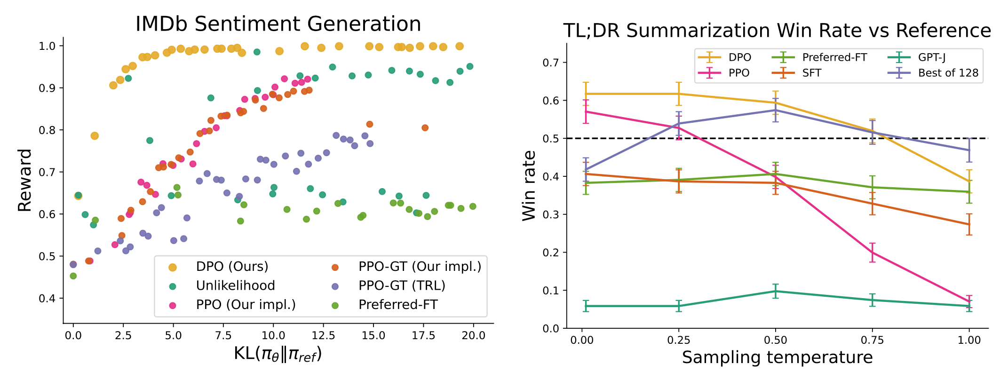
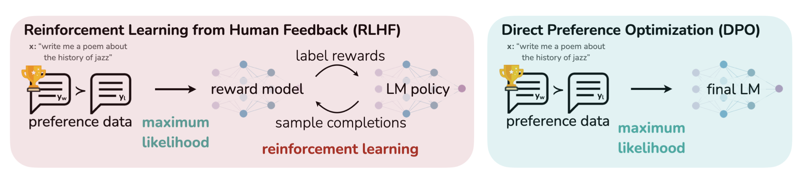

## LLM Alignment
--- 
This is an overview of the concept of alignment for Large Language Models (LLMs) and two of the seminal works in that regard, Reinforcement Learning with Human Feedback (RLHF)[^1] and Direct Preference Optimization (DPO)[^2].

---

### Alignment

- LLMs are not suitable to be used by humans out-of-the-box (misalignment), because:
    - LLMs are trained for next-token prediction but final goal for them is to follow the user’s instructions helpfully, accurately and safely (the 3 H's) [^3].
- Alignment methods like RLHF and DPO try to alleviate this through preference optimization. At Their core, they use Bradley-Terry model to rank the preferences.

| Alignment |
|-------------------------------|
| <div style="text-align: center;"></div> |

---

### RLHF
- RLHF shifted the paradigm from scaling LLMs to aligning them. It showed that by aligning LLMs, one achieve a performance level, that one cannot achieve even by scaling it by 100X.

| Impact of RLHF on the field [^1] |
|-------------------------------|
| <div style="text-align: center;"></div> |

- RLHF algorithm can be summarized in 3 main steps:
  1. Fine-tuning a pre-trained LM with supervised learning on high-quality data for the downstream task of interest (summarization, etc.), to obtain a policy model $\pi_{\text{SFT}}$
  2. Reward Modeling Phase

```math
p^*\left(y_1 \succ y_2 \mid x\right)=\frac{\exp \left(r^*\left(x, y_1\right)\right)}{\exp \left(r^*\left(x, y_1\right)\right)+\exp \left(r^*\left(x, y_2\right)\right)}
```

```math
\mathcal{L}_R\left(r_\phi, \mathcal{D}\right)=-\mathbb{E}_{\left(x, y_w, y_l\right) \sim \mathcal{D}}\left[\log \sigma\left(r_\phi\left(x, y_w\right)-r_\phi\left(x, y_l\right)\right)\right]
```
  3. RL Fine-Tuning Phase
    
```math
\max _{\pi_\theta} \mathbb{E}_{x \sim \mathcal{D}, y \sim \pi_\theta(y \mid x)}\left[r_\phi(x, y)\right]-\beta \mathbb{D}_{\mathrm{KL}}\left[\pi_\theta(y \mid x) \| \pi_{\mathrm{ref}}(y \mid x)\right]
``` 
- By maximizing the reward using PPO algorithm 
```math
r(x, y)=r_\phi(x, y)-\beta\left(\log \pi_\theta(y \mid x)-\log	\pi_{\mathrm{ref}}(y \mid x)\right)
```
 ---
 
### DPO
- Implicit reward
    - DPO starts with the same RL objective of RLHF and after some math, expresses the human preference data in terms of only policy model instead of reward model.

```math
\pi_r(y \mid x) = \frac{1}{Z(x)} \pi_{\mathrm{ref}}(y \mid x) \exp 	\left(\frac{1}{\beta} r(x, y)\right)
```
```math
\Rightarrow r(x, y) = \beta \log \frac{\pi_r(y \mid 	x)}{\pi_{\text{ref}}(y \mid x)} + \beta \log Z(x), \ Z(x)= \sum_y \pi_{\mathrm{ref}}(y \mid x) \exp \left(\frac{1}{\beta} r(x, y)\right) 
```
```math
\mathcal{L}_{\mathrm{DPO}}\left(\pi_\theta ; 	\pi_{\mathrm{ref}}\right)=-\mathbb{E}_{\left(x, y_w, y_l\right) \sim \mathcal{D}}\left[\log \sigma\left(\beta \log \frac{\pi_\theta\left(y_w \mid x\right)}{\pi_{\mathrm{ref}}\left(y_w \mid x\right)}-\beta \log \frac{\pi_\theta\left(y_l \mid x\right)}{\pi_{\mathrm{ref}}\left(y_l \mid x\right)}\right)\right]
```
- DPO update

```math
\nabla_\theta \mathcal{L}_{\mathrm{DPO}}\left(\pi_\theta ; \pi_{\mathrm{ref}}\right)= -\beta \mathbb{E}_{\left(x, y_w, y_l\right) \sim \mathcal{D}} [\underbrace{\sigma\left(\hat{r}_\theta\left(x, y_l\right)-\hat{r}_\theta\left(x, y_w\right)\right)}_{\text {higher weight when reward estimate is wrong }}[\underbrace{\nabla_\theta \log \pi\left(y_w \mid x\right)}_{\text {increase likelihood of } y_w}-\underbrace{\nabla_\theta \log \pi\left(y_l \mid x\right)}_{\text {decrease likelihood of } y_l}]]
```
- When $\pi_{SFT}$ is not available, $\pi_{ref}$ can be initialized by maximizing likelihood of preferred completions $(x,y_w)$

```math
\pi_{\mathrm{ref}}=\arg \max _\pi \mathbb{E}_{x, y_w \sim \mathcal{D}}\left[\log \pi\left(y_w \mid x\right)\right]
```

- Below, the performace of DPO has been shown for summarization task  (right figure) and sentiment generation task (left figure). DPO perform better in summarization task even at the worst temperature values. It also has superior perforamce in sentiment generation task, especially for lower values of KL which is of more importance.

| Performance of DPO [^2] |
|-------------------------------|
| <div style="text-align: center;"></div> |
---

### RLHF vs. DPO
- RLHF cons:
    - RLHF is a multi-step and complex algorithm
    - It uses a actor-critic algorithm (PPO) which is sensitive to hyperparameters. In PPO, we sample the policy model during training and we have a dynamic training set which makes training even more unstable.

- Summary:

| Summary of both alignment methods [^2] |
|-------------------------------|
| <div style="text-align: center;"></div> |

| RLHF | DPO |
| :-----------: | :-----------: |
| Enables real exploration thanks to RL algorithm | Supervised fine-tuning |
| Complex and unstable training, dynamic training set  | Simple and stable training, static training set |
| Explicit reward modeling | Implicit reward modeling |
### References

[^1]: [Training language models to follow instructions with human feedback](https://proceedings.neurips.cc/paper_files/paper/2022/hash/b1efde53be364a73914f58805a001731-Abstract-Conference.html)
[^2]: [Direct Preference Optimization: Your Language Model is Secretly a Reward Model](https://proceedings.neurips.cc/paper_files/paper/2023/hash/a85b405ed65c6477a4fe8302b5e06ce7-Abstract-Conference.html)
[^3]: [Askell, Amanda, et al. "A general language assistant as a laboratory for alignment." arXiv preprint arXiv:2112.00861 (2021)](https://arxiv.org/abs/2112.00861)
